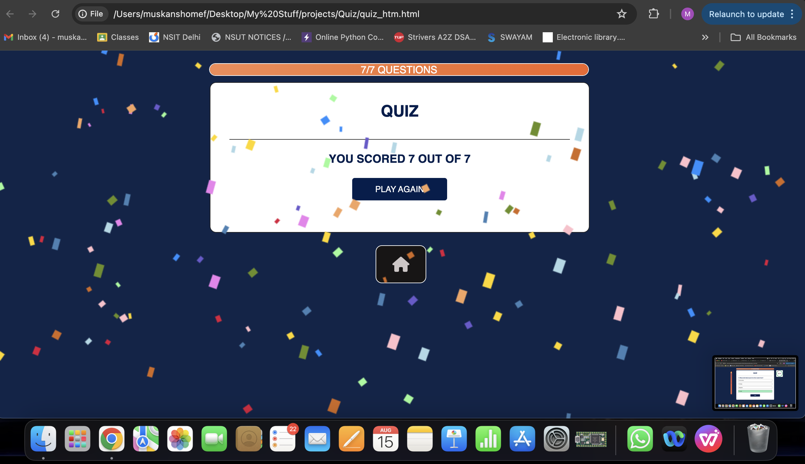

# Quiz site - mini project
made using HTML, CSS, and Javascript

check it out here: https://quiz-miniproject.netlify.app

<h6>The quizzing platform has following functionalities - </h6>
<ul>
  <li>Questions displayed in randomised order each time</li>
  <li>A streak bar</li>
  <li>A progress bar</li>
  <li>A 20 second timer for each question</li>
  <li>Upon answering all 7 questions correctly, a confetti shower follows</li>
  <li>Final score is displayed at the end of the quiz</li>
  <li>After selecting the answer, selection gets disabled. The correct answer turns green and if incorrect answer was selected, the option turns red</li>
</ul>

<h6> Some Screenshots: </h6>

